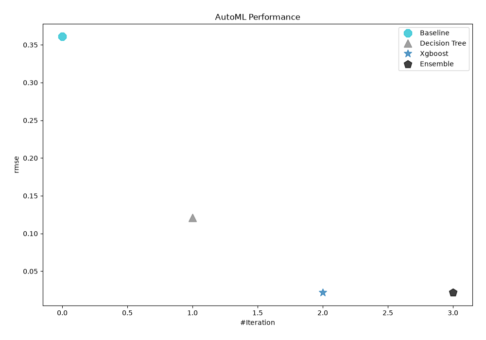
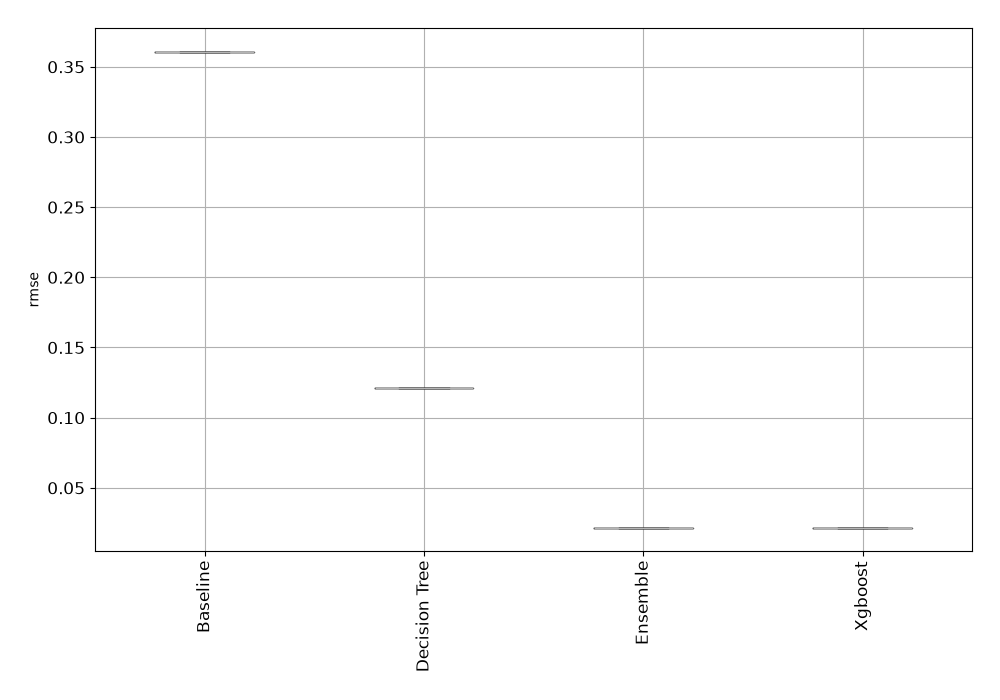
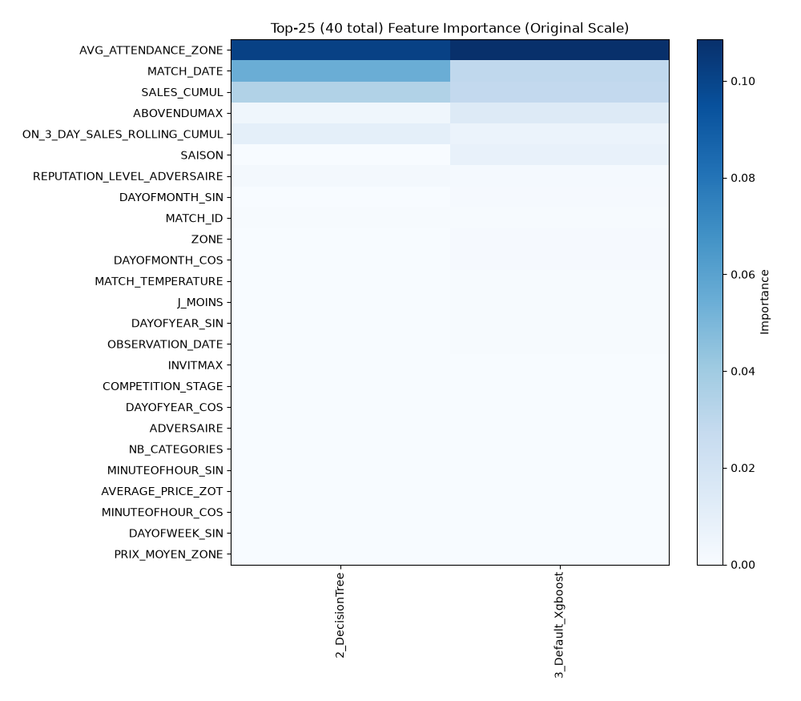
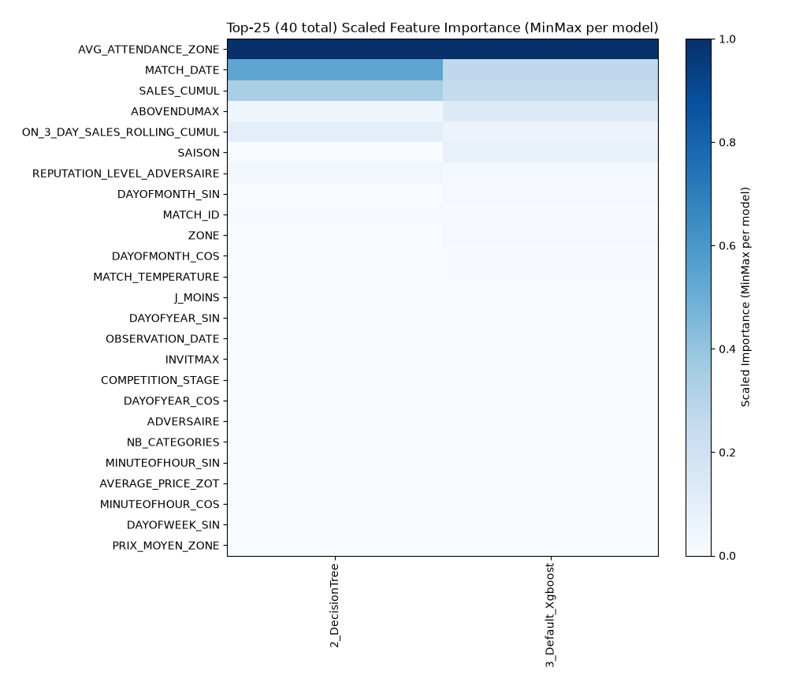
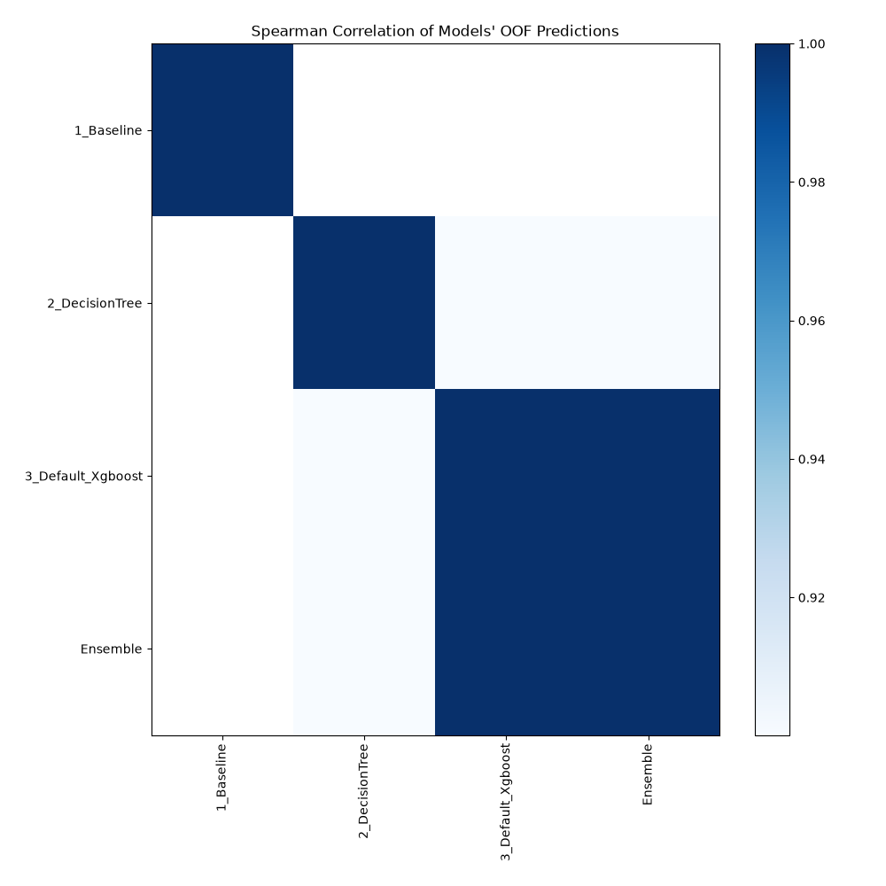

# AutoML Leaderboard

> Models in this report were generated and selected automatically by MLJAR AutoML. Review model behavior, data suitability, and decision impact before important use.

| Best model   | name                                             | model_type    | metric_type   |   metric_value |   train_time |
|:-------------|:-------------------------------------------------|:--------------|:--------------|---------------:|-------------:|
|              | [1_Baseline](1_Baseline/README.md)               | Baseline      | rmse          |      0.360844  |         0.77 |
|              | [2_DecisionTree](2_DecisionTree/README.md)       | Decision Tree | rmse          |      0.120991  |        19.22 |
| **the best** | [3_Default_Xgboost](3_Default_Xgboost/README.md) | Xgboost       | rmse          |      0.0217288 |       394.33 |
|              | [Ensemble](Ensemble/README.md)                   | Ensemble      | rmse          |      0.0217288 |         0.15 |

### AutoML Performance

### AutoML Performance Boxplot

### Features Importance (Original Scale)

### Scaled Features Importance (MinMax per Model)

### Spearman Correlation of Models

