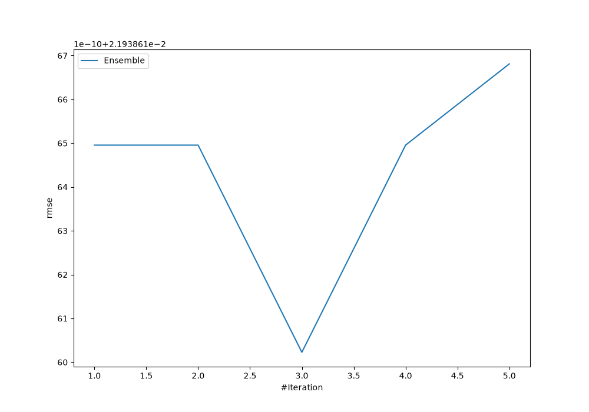
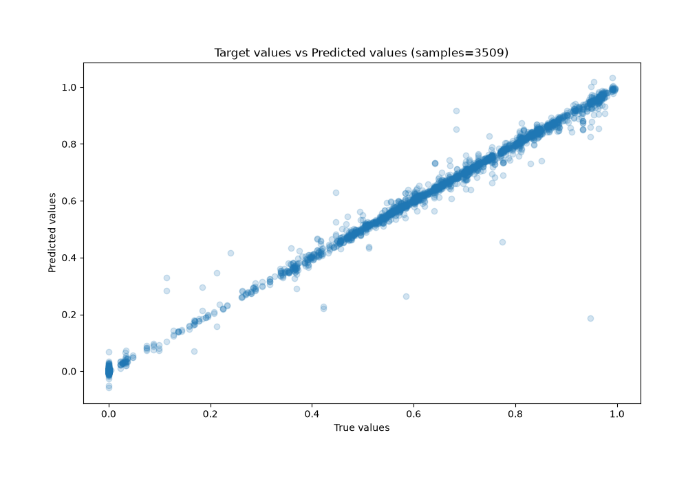
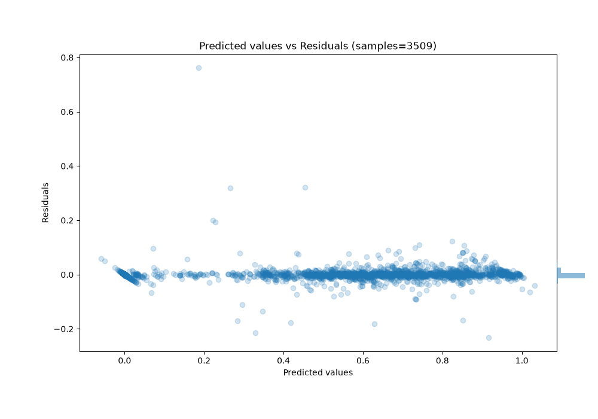

# Summary of Ensemble

[<< Go back](../README.md)

## Ensemble structure
| Model             |   Weight |
|:------------------|---------:|
| 3_Default_Xgboost |        3 |

### Metric details:
| Metric   |       Score |
|:---------|------------:|
| MAE      | 0.00720967  |
| MSE      | 0.000481303 |
| RMSE     | 0.0219386   |
| R2       | 0.996304    |
| MAPE     | 4.03873e+12 |

## Learning curves

## True vs Predicted

## Predicted vs Residuals

[<< Go back](../README.md)
