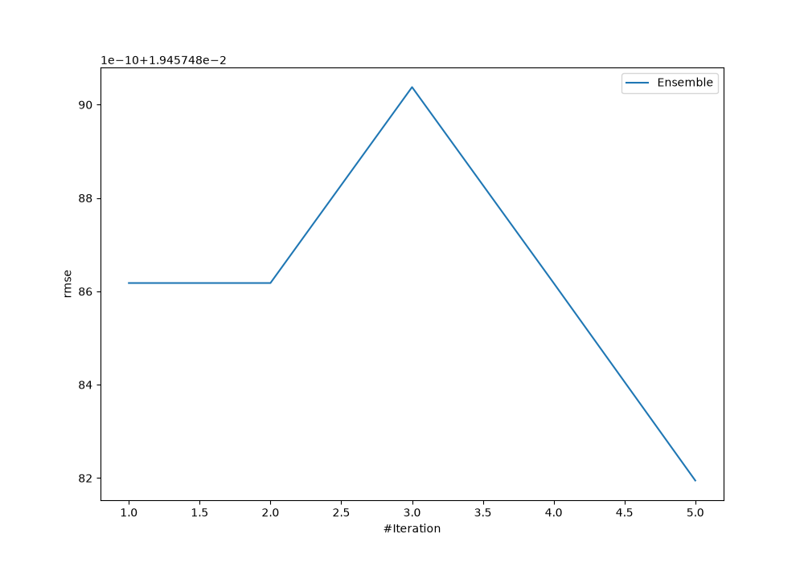
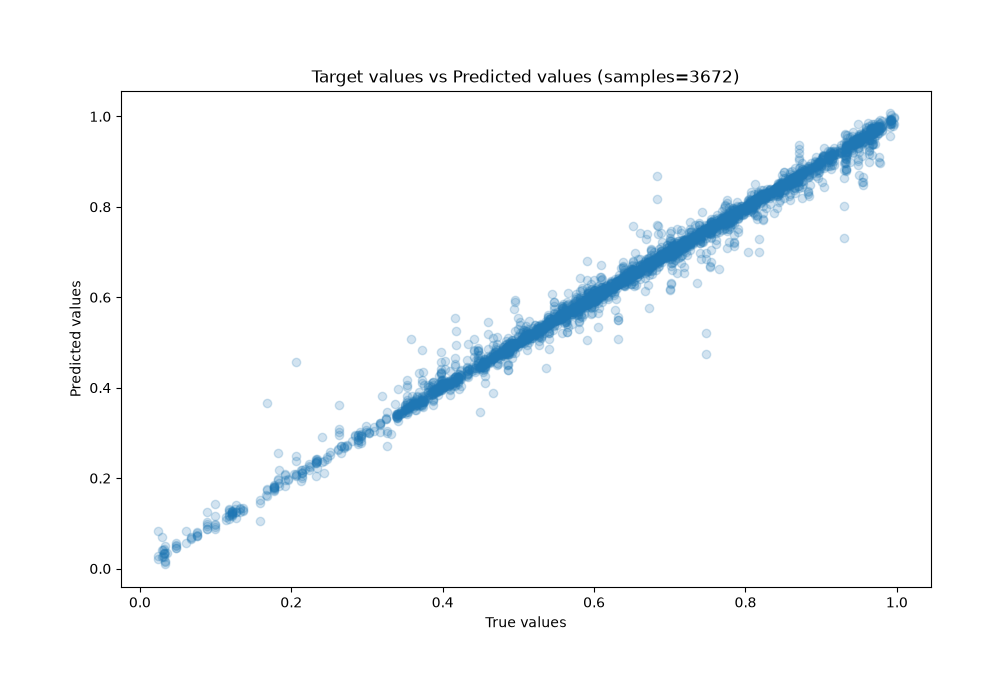
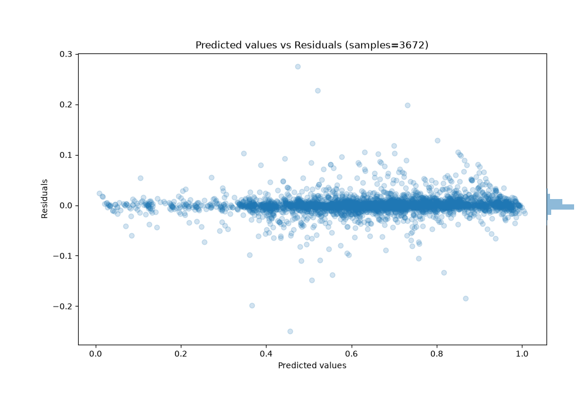

# Summary of Ensemble

[<< Go back](../README.md)

## Ensemble structure
| Model             |   Weight |
|:------------------|---------:|
| 3_Default_Xgboost |        5 |

### Metric details:
| Metric   |       Score |
|:---------|------------:|
| MAE      | 0.00969748  |
| MSE      | 0.000378594 |
| RMSE     | 0.0194575   |
| R2       | 0.99022     |
| MAPE     | 0.0197934   |

## Learning curves

## True vs Predicted

## Predicted vs Residuals

[<< Go back](../README.md)
