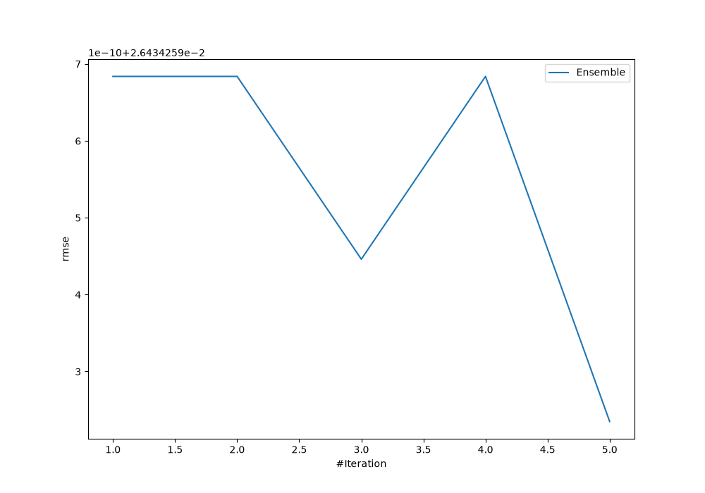
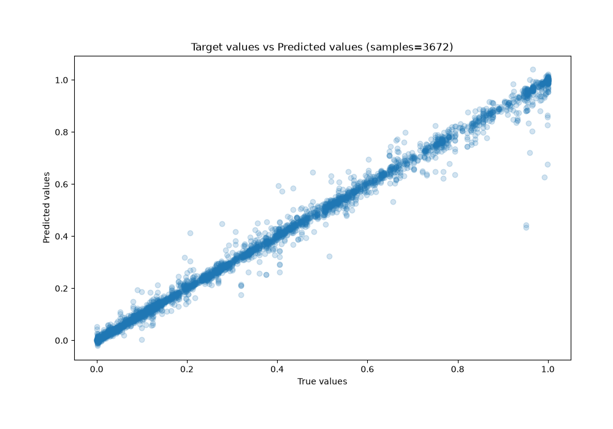
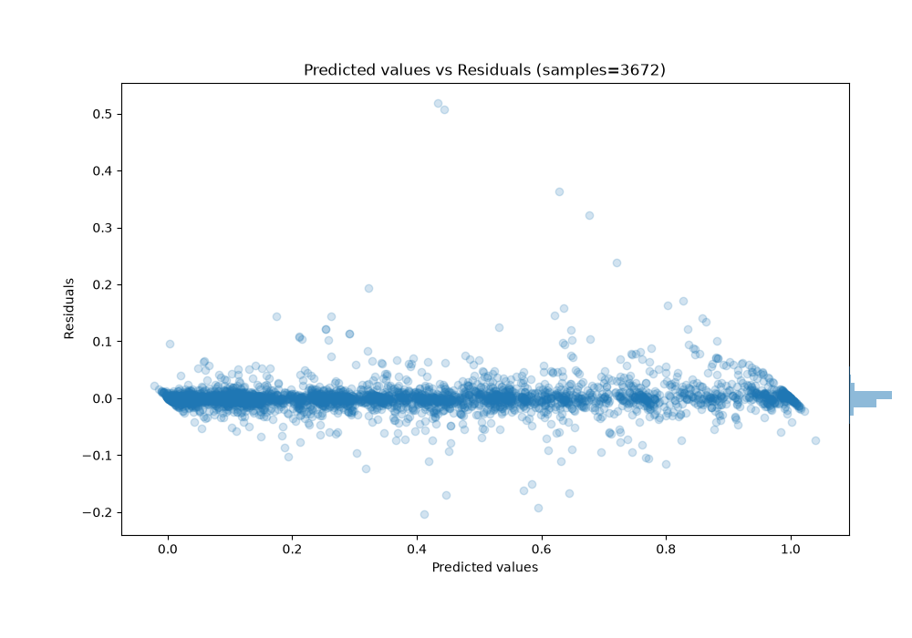

# Summary of Ensemble

[<< Go back](../README.md)

## Ensemble structure
| Model             |   Weight |
|:------------------|---------:|
| 3_Default_Xgboost |        5 |

### Metric details:
| Metric   |      Score |
|:---------|-----------:|
| MAE      | 0.0119655  |
| MSE      | 0.00069877 |
| RMSE     | 0.0264343  |
| R2       | 0.99241    |
| MAPE     | 0.173557   |

## Learning curves

## True vs Predicted

## Predicted vs Residuals

[<< Go back](../README.md)
