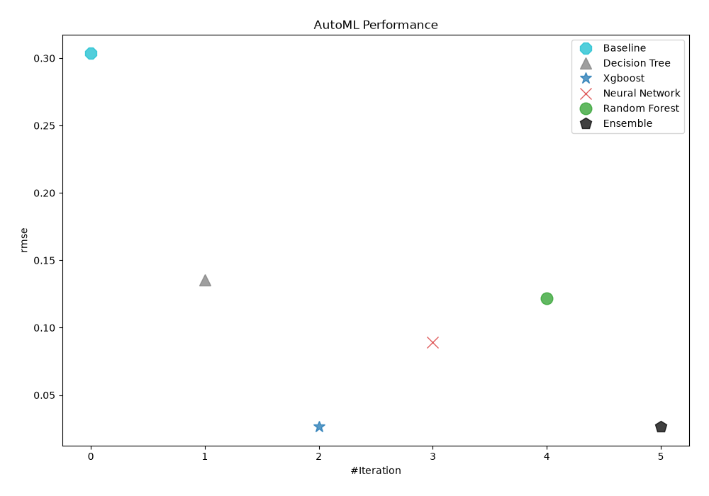
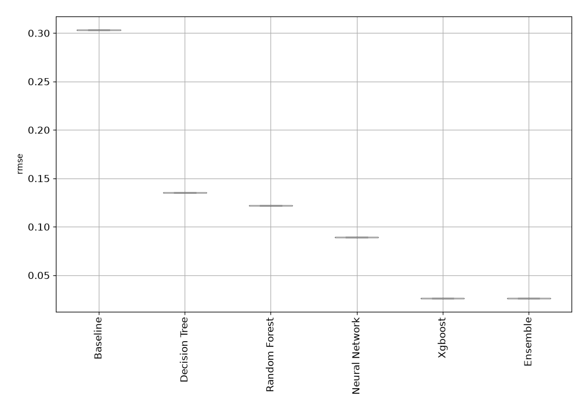
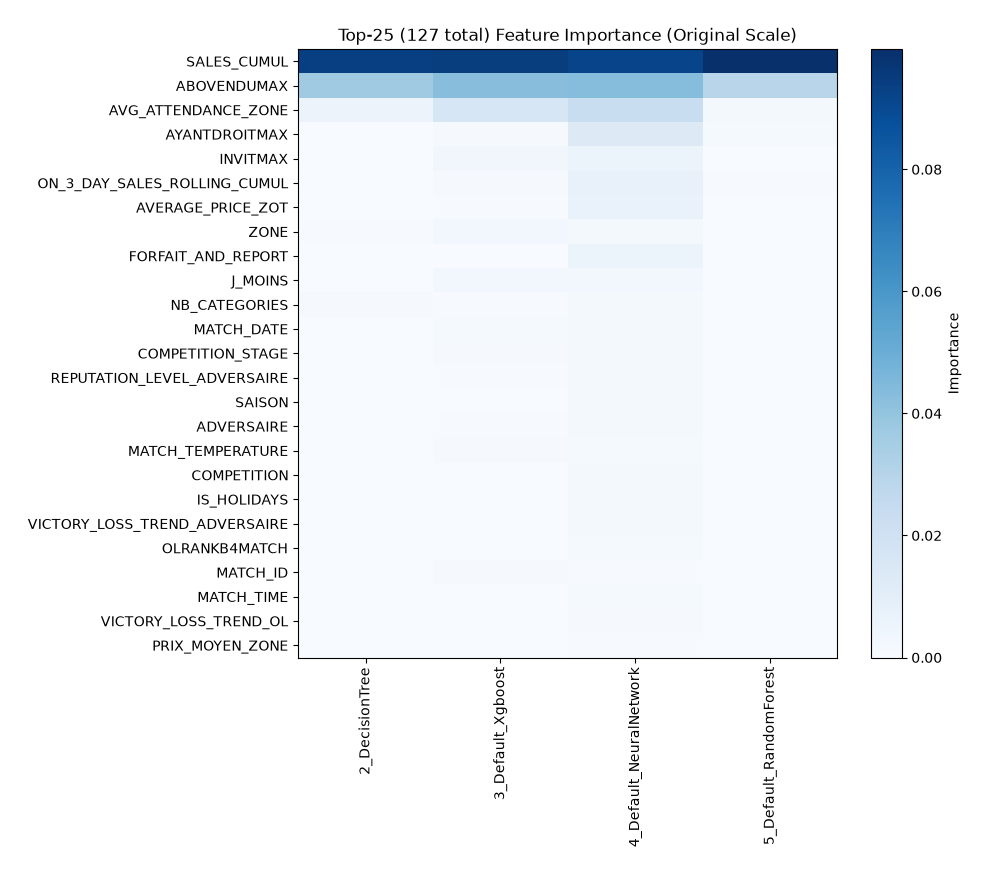
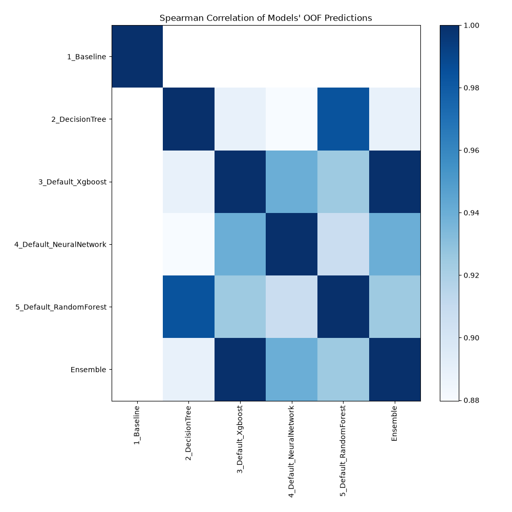

# AutoML Leaderboard

> Models in this report were generated and selected automatically by MLJAR AutoML. Review model behavior, data suitability, and decision impact before important use.

| Best model   | name                                                         | model_type     | metric_type   |   metric_value |   train_time |
|:-------------|:-------------------------------------------------------------|:---------------|:--------------|---------------:|-------------:|
|              | [1_Baseline](1_Baseline/README.md)                           | Baseline       | rmse          |      0.303465  |         0.38 |
|              | [2_DecisionTree](2_DecisionTree/README.md)                   | Decision Tree  | rmse          |      0.13524   |         7.85 |
| **the best** | [3_Default_Xgboost](3_Default_Xgboost/README.md)             | Xgboost        | rmse          |      0.0264343 |        22.73 |
|              | [4_Default_NeuralNetwork](4_Default_NeuralNetwork/README.md) | Neural Network | rmse          |      0.0893784 |         4.31 |
|              | [5_Default_RandomForest](5_Default_RandomForest/README.md)   | Random Forest  | rmse          |      0.121974  |        12.51 |
|              | [Ensemble](Ensemble/README.md)                               | Ensemble       | rmse          |      0.0264343 |         0.11 |

### AutoML Performance

### AutoML Performance Boxplot

### Features Importance (Original Scale)

### Scaled Features Importance (MinMax per Model)

### Spearman Correlation of Models

